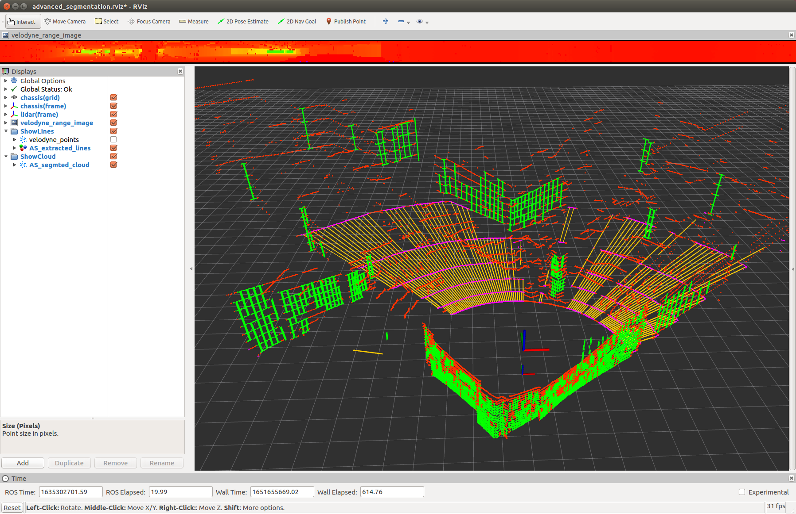

# Efficient Online Segmentation of Ground&Wall Points

## Update 20220625（中文）
1. 所有参数已支持通过`yaml`文件配置！
2. 在提取**墙面点**时，引入了**法向量**信息，支持大入射角时墙面点的准确提取。
3. 支持**任意线数的旋转式机械激光雷达**，已用**16线**和**32线**激光雷达数据充分测试（32线所用测试数据集 [UrbanLoco](https://github.com/weisongwen/UrbanLoco)/HK-Data20190117）。`yaml`文件已预置了`VLP-16`和`HDL-32e`两型激光雷达的参数，可直接使用。
4. 支持激光雷达**以任意姿态安装**，而不仅仅是水平姿态，只需要在`yaml`文件中配置好`kExtrinsicRot`和`kExtrinsicTrans`即可。
5. 添加了外参**旋转矩阵的单位正交属性检查**，如果非单位正交阵，程序报错并退出。
6. 新版的测试视频即将发布。

## Update 20220625 (English)
1. Now you can configure all the parameters simply through a `segmentation_params.yaml` file!
2. Take **normal info** into consideration when **identifying wall points**, which has proven to be very usefull especially with large incident angle!
3. **Support Multi-Line Spinning LiDAR with any lines**! Just modify LiDAR related parameters in `yaml` file. For now, 16-line and 32-line LiDARs, taking `VLP-16` and `HDL-32` as examples respectively, have been fully tested with home-made dataset and [UrbanLoco dataset](https://github.com/weisongwen/UrbanLoco)(HK-Data20190117).  
4. You can **mount your LiDAR in any pose**, not just horizentally. All you need to do is re-write `kExtrinsicRot` and `kExtrinsicTrans` in `yaml` file.
5. Check whether the **input rotation matrix** is a special orthogonal matrix(SO3 group), if not, the program report error and return.
6. New test vedio coming soon.  
  
**UrbanLoco测试截图(Here is a screenshot of test on UrbanLoco dataset):**

## 1. Introduction 
This is a **light-weight & efficient** online segmentation algorithm for segmenting **ground points and wall points** out of an LiDAR point cloud. 

This algorithm is inspired by *"M. Himmelsbach, F. v. Hundelshausen and H. -. Wuensche, **Fast segmentation of 3D point clouds for ground vehicles**, 2010 IEEE Intelligent Vehicles Symposium, 2010"*, an original implementation can be accessed here [linefit_ground_segmentation](https://github.com/lorenwel/linefit_ground_segmentation). 

However, **I have extended the original idea to extract wall points**, not only the ground ones. Also, considering the elevation angle distribution is fixed for multi-line spinning LiDARs, we can use this info to set the size of bins within each segment exactly equal with the size of LiDAR lines (or, rings). By this way, **the total size of bins for line fitting search is impressively reduced, thus making my implementation way faster**.

See the picture below for a first look, where yellow lines(also magenta points) indicate ground points, and green lines(also green points) indicate wall points.

## 2. Results & Videos 
`coming soon ...`  
A test video can be seen on my personal Zhihu homepage, click [here](https://zhuanlan.zhihu.com/p/508961457).

## 3. Algorithm Detail & Implementation
`coming soon ...`  
A chinese version can be seen on my personal Zhihu homepage, click [here](https://zhuanlan.zhihu.com/p/508961457).

## 4. Dependencies 
This project is light-weight in dependencies, only **PCL & OpenCV** are required, you can easily install these two by `apt-get install`. Note that PCL is essential while OpenCV is only for visualization of range image. A developer should take no trouble to remove OpenCV dependency with just a little bit modification on original codes.

## 5. Compile & Run
Once you have solved the dependencies problem, just execute `catkin_make` and `roslaunch efficient_online_segmentation efficient_online_segmentation.launch`. See the *.launch* file for detail.

By default, **VLP-16 LiDAR and HDL-32 LiDAR** are supported. If you want to see how **64/128-line LiDAR scanner** work, just modify LiDAR related parameters in `yaml` file.

## 6. Future TODOs  
Not any more after I took the normal info into consideration for wall points extraction. I would be grateful if you happen to have some ideas and willing to share them with me.  
